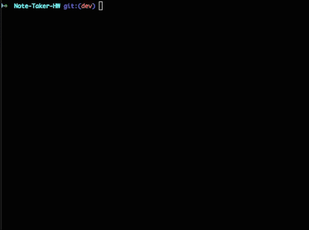

# Note Taker

## Table of Contents
* [Description](#description)
* [Installation Instructions](#installation-instructions)
* [Usage Information](#usage-information)
* [Contribution Guidelines](#contribution-guidelines)
* [Test Instructions](#test-instructions)
* [Questions](#questions)

## Description
A back-end for a pre-build note taking app

## Installation Instructions
clone the repo, then run npm install

## Usage Information
Run locally using ```node server.js``` or visit the live version [here](https://dashboard.heroku.com/apps/polar-hollows-29717)


## Contribution Guidelines
If you wish to contribute, open an issue on the GitHub page

## Test Instructions
Testing is done with Jest. Run ```npm run test``` to test

	

## Questions
Email [hello@n8blake.com](mailto:hello@n8blake.com)
or create an issue on [Github](https://github.com/n8blake)  